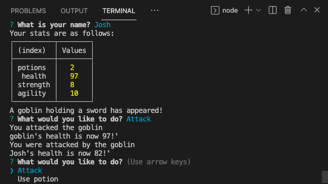

# Jest Another RPG

This is a node command line RPG. I made it with Jest, Node.js, and JavaScript. I built it to practice using Jest testing.

# Usage

Download the code, install node, and play the game from your command line interface.

Please submit an issue if you see a bug or a suggested improvement.

## Screenshot

